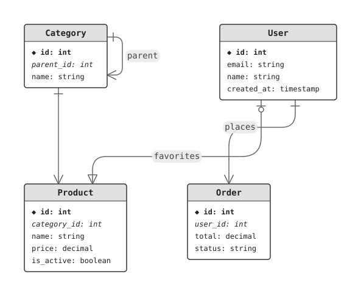

# rusterd

ER diagram DSL compiler that renders to SVG. Written in Rust, compiles to WASM for browser use.

Live demo: https://misebox.github.io/rusterd/

## Features

- **Entities**: Define tables with typed columns
- **Column types**: `int`, `string`, `decimal`, `timestamp`, `boolean`, `text`
- **Constraints**: `pk`, `fk -> Entity.column`, `not null`, `unique`
- **Relationships**: Support all cardinalities (`1`, `*`, `0..1`, `1..*`)
- **Self-references**: Entities can reference themselves
- **Layout hints**: Grid-based positioning with `@hint.arrangement`
- **Views**: Filter diagrams with `view` blocks
- **Detail levels**: Control what's shown (tables only, pk, pk+fk, all columns)

## Example

`examples/sample.erd`:

```erd
# Grid-based layout
@hint.arrangement = {
    Category User;
    Product Order
}

# Self-referential entity
entity Category {
    id int pk
    parent_id int fk -> Category.id
    name string not null
}

entity User {
    id int pk
    email string unique not null
    name string
    created_at timestamp
}

entity Product {
    id int pk
    category_id int fk -> Category.id
    name string not null
    price decimal
    is_active boolean
}

entity Order {
    id int pk
    user_id int fk -> User.id
    total decimal
    status string not null
}

# All cardinality types: 1, *, 0..1, 1..*
rel {
    Category 1 -- * Category : "parent"
    Category 1 -- * Product
    User 1 -- * Order : "places"
    User 0..1 -- 1..* Product : "favorites"
}

# Filtered view
view simple {
    include User, Order
}
```

Rendered with `rusterd render examples/sample.erd -o docs/sample.svg`:



## Install

| Use it as | How |
| --- | --- |
| Browser / bundler | `npm i rusterd` (also `bun add` / `pnpm add`) |
| CLI | `cargo install --path .` — not published to crates.io yet |
| Rust library | `rusterd = { git = "https://github.com/misebox/rusterd" }` |

## CLI Usage

```bash
# Render to file
rusterd render input.erd -o output.svg

# Render specific view
rusterd render input.erd -v simple -o output.svg

# Control detail level
rusterd render input.erd -d pk_fk -o output.svg

# Read from stdin
cat input.erd | rusterd render - -o output.svg

# Convert a SQL dump to ERD notation
rusterd convert schema.sql -o schema.erd
rusterd convert schema.sql -d postgres
```

**SQL dialects:** `auto` (default), `generic`, `postgres`, `mysql`

**Detail levels:**
- `tables` - Entity names only
- `pk` - Primary keys
- `pk_fk` - Primary and foreign keys
- `all` - All columns (default)

## Browser Usage (WASM)

```javascript
import init, { erdToSvg, erdToDataUri, sqlToErd, sqlToSvg } from 'rusterd';

await init();

erdToSvg(source);                  // SVG markup for the whole diagram
erdToSvg(source, 'simple');        // a named view
erdToSvg(source, null, 'pk_fk');   // a detail level
erdToDataUri(source);              // data: URI, ready for 
sqlToErd(sqlDump, 'postgres');     // SQL dump -> ERD notation
sqlToSvg(sqlDump, 'postgres');     // SQL dump -> SVG
```

Every argument after the source is optional and accepts `null`. Errors (parse
failures, unknown view names) are thrown as strings.

## Rust Library Usage

Parse, build the graph, lay it out, render:

```rust
use rusterd::ir::{DetailLevel, GraphIR};
use rusterd::layout::LayoutEngine;
use rusterd::parser::Parser;
use rusterd::svg::SvgRenderer;

let schema = Parser::new(source)?.parse()?;
let ir = GraphIR::from_schema(&schema, None, DetailLevel::All);
let layout = LayoutEngine::default().layout(&ir);
let svg = SvgRenderer::default().render(&ir, &layout);
```

`rusterd::sql::parse_sql` plus `rusterd::serializer::serialize` cover the SQL
to ERD direction.

## Development

```bash
cargo test                    # includes routing checks over examples/
bin/build                     # release binary + wasm-pack build
bin/svg examples/sample.erd   # render one file next to its source
bin/dev                       # render every example
bin/docs                      # regenerate the diagrams in this README
cd demo && bun run dev        # demo app on the local wasm build

bin/release patch             # show what a patch release would do
bin/release minor --yes       # bump, commit, tag, publish to crates.io and npm, push
bin/release current --yes     # release the version already in Cargo.toml
```

## Syntax Reference

### Entities

```erd
entity EntityName {
    column_name type [constraints]
}
```

### Relationships

```erd
rel {
    Entity1 cardinality -- cardinality Entity2 [: "label"]
}
```

Cardinalities: `1`, `*`, `0..1`, `1..*`

### Layout Hints

```erd
# Grid-based arrangement (semicolons separate rows)
@hint.arrangement = {
    Entity1 Entity2;
    Entity3 Entity4
}

# Entity-specific level hint (inside the entity body)
entity EntityName {
    @hint.level = 2
    column_name type
}
```

### Views

```erd
view view_name {
    include Entity1, Entity2, Entity3
}
```

## Examples

See `examples/` directory for more samples including:
- Many columns layout
- Deep hierarchies
- Dense relationships
- Unicode/CJK text
- Self-referential entities
- Complex e-commerce schema

## License

MIT
